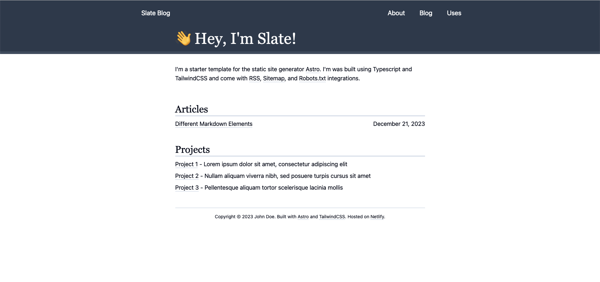

# Slate Astro Template



Features:

- [Tailwind integrated](https://docs.astro.build/en/guides/integrations-guide/tailwind/)
- [Sitemap support](https://docs.astro.build/en/guides/integrations-guide/sitemap/)
- [Robots.txt support](https://github.com/alextim/astro-lib/tree/main/packages/astro-robots-txt#readme)
- [RSS Feed support](https://docs.astro.build/en/guides/rss/#_top)
- Markdown support

## Commands

All commands need to be run from the root of the project. The project is setup with `npm`.

```bash
# install dependencies
$ npm i
# start local dev server
$ npm run dev
# build production site
$ npm run build
# preview build locally
$ npm run preview
```

## Support

If you'd like to support the development of this template, you can [buy me a coffee](https://www.buymeacoffee.com/jaytyrrell).
